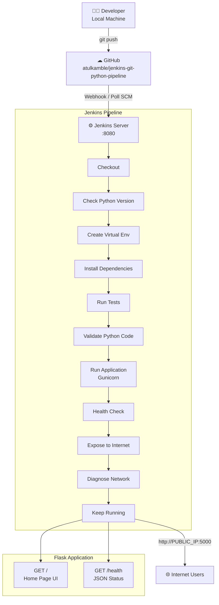

# Jenkins Git Python Pipeline

A production-ready **Jenkins Declarative Pipeline** for a Python Flask web application with a modern dark-theme UI, served by **Gunicorn** and exposed publicly.

---

## Table of Contents

- [Overview](#overview)
- [Architecture](#architecture)
- [Project Structure](#project-structure)
- [Pipeline Flow](#pipeline-flow)
- [Prerequisites](#prerequisites)
- [System Setup](#system-setup)
- [Run Locally](#run-locally)
- [Run with Gunicorn](#run-with-gunicorn)
- [Jenkins Plugin Setup](#jenkins-plugin-setup)
- [Jenkins Job Configuration](#jenkins-job-configuration)
- [Pipeline Stages](#pipeline-stages)
- [API Endpoints](#api-endpoints)
- [Expose to Internet](#expose-to-internet)
- [Expected Output](#expected-output)
- [Troubleshooting](#troubleshooting)

---

## Overview

This project demonstrates a full CI/CD pipeline using Jenkins and GitHub for a Python Flask web application. The pipeline automates the complete lifecycle from code push to a live, publicly accessible web server.

**Tech Stack:**

| Layer | Technology |
|---|---|
| Web Framework | Flask 3.x |
| WSGI Server | Gunicorn 26.x |
| CI/CD | Jenkins (Declarative Pipeline) |
| Source Control | Git / GitHub |
| Language | Python 3.12 |
| Frontend | HTML5, CSS3 (dark theme, no frameworks) |

---

## Architecture



### Infrastructure Diagram

```
┌─────────────────────────────────────────────────────────────┐
│                      Ubuntu Server / EC2 / VM               │
│                                                             │
│  ┌──────────────────┐        ┌─────────────────────────┐   │
│  │  Jenkins (:8080) │        │  Gunicorn (:5000)       │   │
│  │                  │ starts │  workers = 2×CPU+1      │   │
│  │  Pipeline Job    │───────▶│  bind = 0.0.0.0:5000    │   │
│  │  (Jenkinsfile)   │        │  app:app                │   │
│  └──────────────────┘        └────────────┬────────────┘   │
│                                           │                 │
│                                    Flask App                │
│                                    ├── GET /               │
│                                    └── GET /health          │
└───────────────────────────────────────────┼─────────────────┘
                                            │
                              ┌─────────────▼──────────────┐
                              │   UFW / Cloud Security Group│
                              │   Allow TCP :5000  0.0.0.0/0│
                              └─────────────┬──────────────┘
                                            │
                                    🌐 Public Internet
```

---

## Project Structure

```
jenkins-git-python-pipeline/
├── Jenkinsfile              # Jenkins Declarative Pipeline
├── app.py                   # Flask application (routes + health)
├── gunicorn.conf.py         # Gunicorn production configuration
├── requirements.txt         # Python dependencies
├── templates/
│   ├── base.html            # Shared layout (navbar, footer)
│   └── index.html           # Home page with live health widget
├── static/
│   └── css/
│       └── style.css        # Dark modern UI theme
└── README.md
```

---

## Pipeline Flow

```
┌──────────────────────────────────────────────────────────────────────────────────────────┐
│                              JENKINS DECLARATIVE PIPELINE                                │
└──────────────────────────────────────────────────────────────────────────────────────────┘

  ┌───────────┐   ┌──────────────┐   ┌─────────────────┐   ┌──────────────────┐
  │ Checkout  │──▶│ Check Python │──▶│  Create VirtualE │──▶│Install Dependencies│
  │ (git pull)│   │   Version    │   │   nvironment     │   │flask + gunicorn  │
  └───────────┘   └──────────────┘   └─────────────────┘   └────────┬─────────┘
                                                                      │
  ┌───────────┐   ┌──────────────┐   ┌─────────────────┐             │
  │Run Tests  │◀──│   Validate   │◀──│   Run Tests     │◀────────────┘
  │(pytest)   │   │ Python Code  │   │  (if tests/ dir)│
  └─────┬─────┘   └──────────────┘   └─────────────────┘
        │
        ▼
  ┌──────────────────┐   ┌──────────────┐   ┌──────────────────┐
  │  Run Application │──▶│ Health Check │──▶│Expose to Internet│
  │  (Gunicorn nohup)│   │curl :5000 ×10│   │UFW + Public IP   │
  └──────────────────┘   └──────────────┘   └────────┬─────────┘
                                                       │
  ┌──────────────────┐   ┌──────────────┐             │
  │   Keep Running   │◀──│Diagnose      │◀────────────┘
  │  (disown PID)    │   │Network (ss)  │
  └──────────────────┘   └──────────────┘

  POST (always):
  ┌──────────────────────────────────────────────┐
  │ Archive Artifacts → flask-app.log            │
  │ Archive Artifacts → gunicorn-boot.log        │
  │ Archive Artifacts → public-ip.txt            │
  │ Cleanup __pycache__ / .pyc files             │
  └──────────────────────────────────────────────┘
```

---

## Prerequisites

| Requirement | Version | Install |
|---|---|---|
| Python | 3.10+ | `sudo apt install python3` |
| pip | 23+ | `sudo apt install python3-pip` |
| venv | 3.12 | `sudo apt install python3.12-venv` |
| Git | 2.x | `sudo apt install git` |
| curl | any | `sudo apt install curl` |
| Jenkins | 2.400+ | [jenkins.io/download](https://www.jenkins.io/download/) |

---

## System Setup

### 1. Update packages

```bash
sudo apt update && sudo apt upgrade -y
```

### 2. Install Python and tools

```bash
sudo apt install -y python3 python3-pip python3.12-venv git curl
```

### 3. Verify versions

```bash
python3 --version   # Python 3.12.x
pip --version       # pip 24.x
git --version       # git version 2.x
```

### 4. (Optional) Grant Jenkins passwordless sudo for UFW

To allow the pipeline to open the firewall port automatically:

```bash
echo "jenkins ALL=(ALL) NOPASSWD: /usr/sbin/ufw" | sudo tee /etc/sudoers.d/jenkins-ufw
sudo chmod 440 /etc/sudoers.d/jenkins-ufw
```

---

## Run Locally

### 1. Clone the repository

```bash
git clone https://github.com/atulkamble/jenkins-git-python-pipeline.git
cd jenkins-git-python-pipeline
```

### 2. Create and activate virtual environment

```bash
python3 -m venv venv
source venv/bin/activate          # Linux / macOS
# venv\Scripts\activate           # Windows
```

### 3. Install dependencies

```bash
pip install --upgrade pip
pip install -r requirements.txt
```

### 4. Run with Flask dev server

```bash
python app.py
```

Open: [http://127.0.0.1:5000](http://127.0.0.1:5000)

---

## Run with Gunicorn

### Using CLI flags

```bash
venv/bin/gunicorn \
  --workers 4 \
  --bind 0.0.0.0:5000 \
  --timeout 120 \
  --access-logfile flask-app.log \
  --error-logfile flask-app.log \
  app:app
```

### Using config file (recommended for production)

```bash
venv/bin/gunicorn -c gunicorn.conf.py app:app
```

### Run in background (detached)

```bash
nohup venv/bin/gunicorn -c gunicorn.conf.py app:app > gunicorn-boot.log 2>&1 &
echo $! > flask-app.pid
echo "Running with PID $(cat flask-app.pid)"
```

### Stop the server

```bash
kill $(cat flask-app.pid)
```

---

## Jenkins Plugin Setup

Go to **Manage Jenkins → Plugin Manager** and install:

| Plugin | Purpose |
|---|---|
| Git Plugin | Clone repositories from GitHub |
| Pipeline | Enable Declarative Pipeline support |
| Timestamper | Add timestamps to console output |
| GitHub Integration Plugin | Webhook-based auto-trigger (optional) |

---

## Jenkins Job Configuration

### Step 1 — Create a New Pipeline Job

1. Jenkins Dashboard → **New Item**
2. Name: `jenkins-git-python-pipeline`
3. Type: **Pipeline** → click **OK**

### Step 2 — Configure Pipeline Source

Under the **Pipeline** section:

| Field | Value |
|---|---|
| Definition | Pipeline script from SCM |
| SCM | Git |
| Repository URL | `https://github.com/atulkamble/jenkins-git-python-pipeline.git` |
| Branch | `*/main` |
| Script Path | `Jenkinsfile` |

### Step 3 — (Optional) Webhook Auto-Trigger

Under **Build Triggers** → check **GitHub hook trigger for GITScm polling**

Add webhook in GitHub repo settings:
```
http://<jenkins-url>:8080/github-webhook/
```

---

## Pipeline Stages

| # | Stage | What it does |
|---|---|---|
| 1 | **Checkout** | Clones `main` branch from GitHub |
| 2 | **Check Python Version** | Prints Python and pip versions |
| 3 | **Create Virtual Environment** | Recreates `venv/` from scratch |
| 4 | **Install Dependencies** | Installs Flask, Gunicorn, pytest from `requirements.txt` |
| 5 | **Run Tests** | Runs `pytest tests/ -v` if `tests/` directory exists |
| 6 | **Validate Python Code** | `compileall` — catches syntax errors across all `.py` files |
| 7 | **Run Application** | Starts Gunicorn with `2×CPU+1` workers via `nohup` |
| 8 | **Health Check** | Polls `http://127.0.0.1:5000` up to 10 times (3s apart) |
| 9 | **Expose to Internet** | Opens UFW port, resolves and saves public IP |
| 10 | **Diagnose Network** | Verifies `0.0.0.0:5000` binding with `ss`, prints cloud firewall commands |
| 11 | **Keep Running** | Calls `disown` so Gunicorn survives beyond the build |
| Post | **Always** | Archives `flask-app.log`, `gunicorn-boot.log`, `public-ip.txt` |
| Post | **Cleanup** | Removes `__pycache__` and `.pyc` files |

---

## API Endpoints

| Method | Endpoint | Response | Description |
|---|---|---|---|
| `GET` | `/` | `text/html` | Home page with modern dark UI |
| `GET` | `/health` | `application/json` | Live health status |

### `/health` response example

```json
{
  "status": "ok",
  "uptime": "0:12:34",
  "python": "3.12.3",
  "platform": "Linux",
  "timestamp": "2026-07-12T15:30:00Z"
}
```

---

## Expose to Internet

After a successful pipeline run, the app is accessible at:

```
http://<PUBLIC_IP>:5000
http://<PUBLIC_IP>:5000/health
```

If the app is not reachable, open port 5000 in your cloud provider:

### AWS EC2 — Security Group

```
Inbound rule: Type=Custom TCP, Port=5000, Source=0.0.0.0/0
```

### Azure VM — NSG

```bash
az network nsg rule create \
  --resource-group YOUR_RG \
  --nsg-name YOUR_NSG \
  --name Allow-5000 \
  --priority 1001 \
  --protocol Tcp \
  --destination-port-ranges 5000 \
  --access Allow \
  --direction Inbound
```

### GCP — Firewall Rule

```bash
gcloud compute firewall-rules create allow-flask-5000 \
  --allow tcp:5000 \
  --source-ranges 0.0.0.0/0 \
  --description "Allow Flask app on port 5000"
```

### OS Firewall (UFW)

```bash
sudo ufw allow 5000/tcp
sudo ufw --force enable
sudo ufw status
```

---

## Expected Output

```
[Checkout]              Checking out source code...
[Check Python Version]  Python 3.12.3 / pip 26.x
[Create VirtualEnv]     Created venv/
[Install Dependencies]  Successfully installed Flask-3.1.3 gunicorn-26.0.0 ...
[Run Tests]             No tests directory found. Skipping pytest.
[Validate Python Code]  Compiling ./app.py ... ./gunicorn.conf.py ...
[Run Application]       Gunicorn started with 9 workers on port 5000
[Health Check]          Application health check passed.
[Expose to Internet]    Public IP resolved: 135.235.218.160
[Diagnose Network]      LISTEN 0.0.0.0:5000  HTTP 200  {"status":"ok"}
[Keep Running]          Flask app is RUNNING with PID: 14107
                        Public URL: http://135.235.218.160:5000

flask-app pipeline completed successfully.
```

---

## Troubleshooting

| Problem | Cause | Solution |
|---|---|---|
| `python3: command not found` | Python not installed | `sudo apt install python3` |
| `pip: command not found` | pip not installed | `sudo apt install python3-pip` |
| `No module named venv` | venv not installed | `sudo apt install python3.12-venv` |
| `sudo: a password is required` | Jenkins has no passwordless sudo | Add jenkins to sudoers for ufw (see System Setup §4) |
| Health check fails | App not starting | Check `flask-app.log` in Jenkins build artifacts |
| Port 5000 already in use | Previous process running | `fuser -k 5000/tcp` |
| App not reachable from internet | Cloud firewall blocking port | Open TCP 5000 inbound rule in AWS SG / Azure NSG / GCP FW |
| `cannot open RG: No such file` | Shell treating `<...>` as redirect | Fixed — angle brackets removed from echo statements |
| Jenkins cannot clone repo | Auth or network issue | Verify repo URL and credentials in Jenkins |
| `gunicorn: command not found` | venv not activated | Use full path: `venv/bin/gunicorn` |

---

## Author

**Atul Kamble** — [github.com/atulkamble](https://github.com/atulkamble)

---

## License

This project is licensed under the terms of the [LICENSE](LICENSE) file.

---

## Table of Contents

- [Overview](#overview)
- [Project Structure](#project-structure)
- [Prerequisites](#prerequisites)
- [System Setup](#system-setup)
- [Jenkins Plugin Setup](#jenkins-plugin-setup)
- [Application Code](#application-code)
- [Pipeline Stages](#pipeline-stages)
- [Jenkins Job Configuration](#jenkins-job-configuration)
- [Running the Pipeline](#running-the-pipeline)
- [Expected Output](#expected-output)
- [Troubleshooting](#troubleshooting)

---

## Overview

This project demonstrates a CI pipeline using Jenkins and Git for a Python Flask web application. The pipeline automates the full lifecycle:

```
Git Checkout → Python Setup → Virtual Env → Install Deps → Tests → Validate → Run App → Health Check → Cleanup
```

---

## Project Structure

```
jenkins-git-python-pipeline/
├── Jenkinsfile          # Jenkins Declarative Pipeline definition
├── app.py               # Flask web application
├── requirements.txt     # Python dependencies
└── README.md            # Project documentation
```

---

## Prerequisites

| Requirement | Version |
|---|---|
| Jenkins | 2.400+ |
| Python | 3.10+ |
| pip | 23+ |
| Git | 2.x |
| curl | any |

- Jenkins installed (locally or on EC2/VM)
- Git and Pipeline plugins installed in Jenkins
- GitHub repository with SSH or HTTPS access
- Agent node has Python 3 available

---

## System Setup

### 1. Install Python pip and venv (Ubuntu/Debian)

```bash
sudo apt update
sudo apt install python3-pip
sudo apt install python3.12-venv
```

### 2. Verify installation

```bash
python3 --version
pip --version
```

Expected output:
```
Python 3.12.x
pip 24.x from /usr/lib/python3/dist-packages/pip (python 3.12)
```

### 3. Install curl (required for health check stage)

```bash
sudo apt install curl
```

---

## Jenkins Plugin Setup

Go to **Manage Jenkins → Plugin Manager** and install:

| Plugin | Purpose |
|---|---|
| Git Plugin | Clone repositories from GitHub |
| Pipeline | Enable Declarative Pipeline support |
| Timestamper | Add timestamps to console output |
| GitHub Integration Plugin | Webhook-based auto-trigger (optional) |

---

## Application Code

### `app.py` — Flask Application

```python
from flask import Flask

app = Flask(__name__)

@app.route("/")
def index():
    return "Hello from Jenkins pipeline project!"

@app.route("/health")
def health():
    return {"status": "ok"}

if __name__ == "__main__":
    app.run(debug=True, host="0.0.0.0", port=5000)
```

### `requirements.txt`

```
flask>=3.0.0
```

---

## Pipeline Stages

The `Jenkinsfile` defines the following stages:

| # | Stage | Description |
|---|---|---|
| 1 | **Checkout** | Clones the `main` branch from GitHub |
| 2 | **Check Python Version** | Prints Python and pip versions |
| 3 | **Create Virtual Environment** | Creates a fresh `venv/` directory |
| 4 | **Install Dependencies** | Installs packages from `requirements.txt` + pytest |
| 5 | **Run Tests** | Runs `pytest tests/` if a tests directory exists |
| 6 | **Validate Python Code** | Compiles all `.py` files to catch syntax errors |
| 7 | **Run Application** | Starts Flask app in the background via `nohup` |
| 8 | **Health Check** | Polls `http://127.0.0.1:5000` up to 10 times |
| **Post** | **Cleanup** | Stops app, archives `flask-app.log`, removes `__pycache__` |

---

## Jenkins Job Configuration

### Step 1 — Create a New Pipeline Job

1. Open Jenkins Dashboard → **New Item**
2. Enter name: `jenkins-git-python-pipeline`
3. Select type: **Pipeline** → click **OK**

### Step 2 — Configure Pipeline Source

Under **Pipeline** section:

- Definition: `Pipeline script from SCM`
- SCM: `Git`
- Repository URL: `https://github.com/atulkamble/jenkins-git-python-pipeline.git`
- Branch: `*/main`
- Script Path: `Jenkinsfile`

### Step 3 — (Optional) Enable Webhook Trigger

Under **Build Triggers**:
- Check **GitHub hook trigger for GITScm polling**
- Add a webhook in your GitHub repo settings pointing to `http://<jenkins-url>/github-webhook/`

---

## Running the Pipeline

1. Click **Build Now** on the job page
2. Open **Console Output** to monitor live logs
3. Each stage will be visible in the **Stage View**

---

## Expected Output

```
[Checkout] Checking out source code...
[Check Python Version] Python 3.12.x / pip 24.x
[Create Virtual Environment] Created venv/
[Install Dependencies] Successfully installed Flask-3.x ...
[Run Tests] No tests directory found. Skipping pytest.
[Validate Python Code] Compiling ...
[Run Application] Flask application started with PID 12345
[Health Check] Application health check passed.
[Post] Flask application stopped.
[Post] Archiving artifacts: flask-app.log
flask-app pipeline completed successfully.
```

---

## Troubleshooting

| Problem | Solution |
|---|---|
| `python3: command not found` | Install Python: `sudo apt install python3` |
| `pip: command not found` | Run `sudo apt install python3-pip` |
| `venv` module missing | Run `sudo apt install python3.12-venv` |
| Health check fails | Check `flask-app.log` archived in Jenkins build artifacts |
| Port 5000 already in use | Kill existing process: `fuser -k 5000/tcp` |
| Jenkins cannot clone repo | Verify repo URL and network access from the Jenkins agent |

---

## Author

**Atul Kamble** — [github.com/atulkamble](https://github.com/atulkamble)

---

## License

This project is licensed under the terms of the [LICENSE](LICENSE) file.
